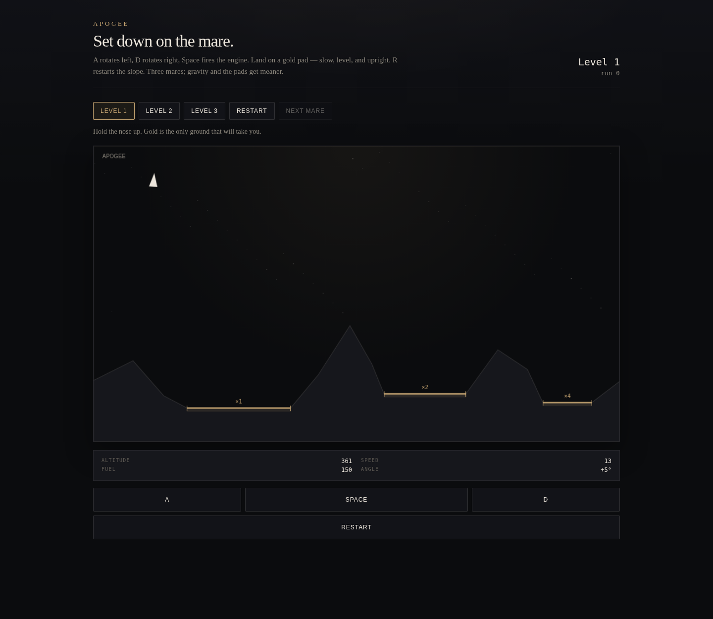

# Apogee

A small lunar lander. Thrust along the nose, rotate, and set down on a gold pad. The rest of the ground is rock.

**Live:** [glibmiklushys.github.io/apogee](https://glibmiklushys.github.io/apogee/)



## How to play

A rotates left. D rotates right. Space fires the engine. R restarts the current mare. On a phone, the three buttons under the view do the same job.

A landing counts when you meet a **gold** pad slowly, with little sideways drift, and nearly upright. A softer touch scores more; leftover fuel does too. Hit the rock, arrive too fast, or come in tilted, and the hull is done.

Three levels. Gravity rises and the pads shrink. Pick a mare from the toolbar, or wait after a landing — the next one follows on its own.

## Physics

The world is 2D. `y` increases downward. Each tick:

```
vy += gravity * dt
if thrusting and fuel remains:
  vx += sin(angle) * thrust * dt
  vy -= cos(angle) * thrust * dt
  fuel -= burn * dt
x += vx * dt
y += vy * dt
```

Angle `0` is nose-up. The hull is a triangle. Contact is triangle versus the terrain polyline: a vertex below the ground, or an edge crossing a segment. Pad segments are the only ones that can accept a ship. The gates are vertical speed, horizontal speed, and |angle|.

`src/sim/step.ts` is the whole motion. It takes `(state, input, dt)` and returns a new state. No DOM, no wall clock. Tests call `step` directly.

## How to run

```bash
npm install
npm test
npm run dev
```

Open the URL Vite prints (usually `http://localhost:5173`).

```bash
npm run build    # typecheck + production bundle
npm run preview  # serve dist/
```

## Architecture

- `src/sim/step.ts` — `step(state, input, dt)`
- `src/sim/collision.ts` — ship vs segments, landing vs crash
- `src/sim/levels.ts` — three authored mares
- `src/ui/` — canvas, HUD, keys, and touch. No React
- `test/` — gravity, a soft pad, a fast impact, fuel burn

## License

MIT © 2026 Glib Miklushys
